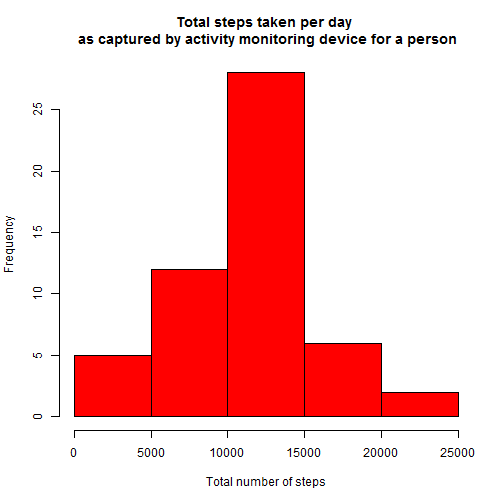
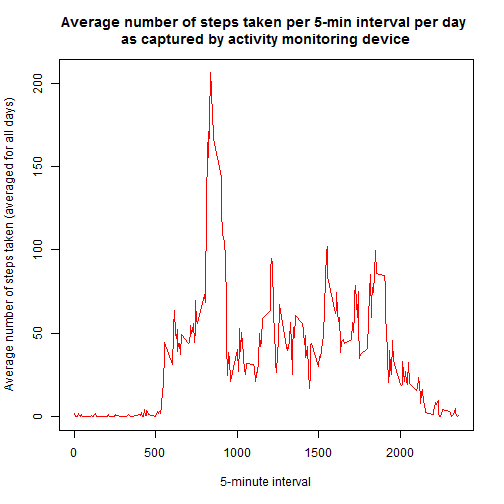
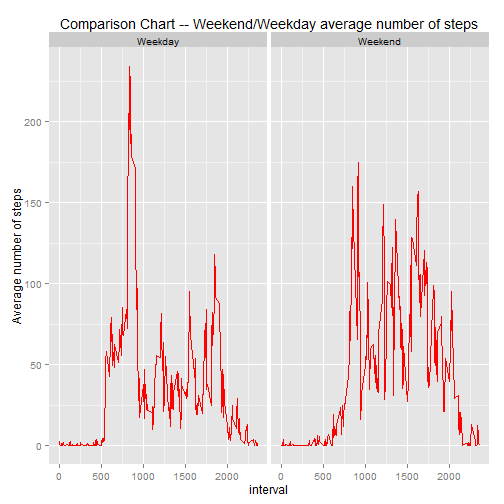

# Course5-Reproducible Research-Project1

## Get libraries such as dplyr, ggplot2

```r
## set the path for dplyr package
## created a summary dataset of sum of steps across days Using dplyr library
.libPaths( c( .libPaths(), "C:/anand/software/r-analytics/packages") )
library(dplyr)
library(ggplot2)
```

## The code to get the data from file


```r
activity_data <- read.csv("activity.csv")
```

## assignment 1

## create the clean data for the plot

```r
##remove rows with NA values
activity_data_with_no_missing_val <- activity_data[complete.cases(activity_data),]
## create the summary data
activity_summary_data_no_NA <- summarise_each(group_by(activity_data_with_no_missing_val,date),funs(sum),c(1))
```

## create the histogram plot using base plot for activity data

```r
## The y axis is frequency of number of steps taken 
## The x axis is number of steps of observation
hist(activity_summary_data_no_NA$steps, 
col="red",main = "Total steps taken per day \n as captured by activity monitoring device for a person",
xlab = "Total number of steps" )
```

 

## calculate the mean and median of the activity data per day

```r
mean_activity_summary_data_no_NA <- mean(activity_summary_data_no_NA$steps)
median_activity_summary_data_no_NA <- median(activity_summary_data_no_NA$steps)
```
The mean of the total number of steps taken per day 10766.1886792453.
The median of the total number of steps taken per day 10765.


## assignment 2

## create the clean data for the plot

```r
## created a summary dataset of average of steps across time intervals Using dplyr library
activity_summary_data_no_NA <- summarise_each(group_by(activity_data_with_no_missing_val,interval),funs(mean),c(1))
```

## create the time series plot using base plot for activity data


```r
## This is a line plot where type = l and line color is red
## The y axis is mean no of steps taken averaged for all days
## The x axis is 5 minute interval of the day
plot(activity_summary_data_no_NA$interval,
activity_summary_data_no_NA$steps,
type="l", col="red",
ylab = "Average number of steps taken (averaged for all days)",
xlab = "5-minute interval",
main ="Average number of steps taken per 5-min interval per day \n as captured by activity monitoring device " )
```

 

## max of the steps taken across 5-minute interval, averaged across all the days

```r
max_activity_summary_data_no_NA <- max(activity_summary_data_no_NA$steps)
```
The max of the average number of steps taken per day at 5-minute interval 206.1698113.


## assignment 3

## Get the total number of missing data rows

```r
missing_no_of_rows <- nrow(activity_data[!complete.cases(activity_data),])
```
The rows with NA (missing values) in dataset is 2304.

### I have adopted the strategy : Where the steps value is NA(missing), fill it with the mean value for the same day. But other startegies to fill the missing values can be also adopted. Different strategies can produce the different set of values for missing fields and so the summary data and accordingly the corresponding graphs also will be different.


```r
##get the summary data steps values are averaged date wise
## use the clean data from the assignment 1
activity_summary_data_no_NA <- summarise_each(group_by(activity_data_with_no_missing_val,date),funs(mean),c(1))

##create a new columns steps_NA_replaced which will have the NA data replaced with daily mean value
## step 1 - create a mean value column in activity_data 
for (i in 1:nrow(activity_data)) {
  activity_data$daily_mean[i] <- activity_summary_data_no_NA[activity_summary_data_no_NA$date == activity_data[i,2],2]	
}

## step 2- if else condition to create the steps_NA_replaced, if value is missing select mean column value
## else steps column value
activity_data <- mutate(activity_data,steps_NA_replaced = ifelse(is.na(steps),activity_data$daily_mean,activity_data$steps))

##still there are some missing values, so get the clean data
##to get the clean data, I am replacing null values with -1 and then 
##selecting data which are not -1
activity_data <- mutate(activity_data,steps_NA_replaced = ifelse(is.na(steps),-1,activity_data$steps_NA_replaced))
activity_data <- activity_data[ activity_data$steps_NA_replaced != -1,]
activity_data$steps_NA_replaced <- as.numeric(activity_data$steps_NA_replaced)
## created a summary dataset of sum of steps_NA_replaced across days
activity_summary_data_NA_replaced <- summarise_each(group_by(activity_data,date),funs(sum),c(5))
```

## create the histogram plot with missing value replaced with daily mean value


```r
## The y axis is frequency of total number of steps taken 
## The x axis is each day of observation
hist(activity_summary_data_NA_replaced$steps_NA_replaced, 
col="red",main = "Total steps taken per day \n as captured by activity monitoring device for a person",
xlab = "Total number of steps" )
```

 

## calculate the mean and median of the activity data per day

```r
mean_activity_summary_data_NA_replaced <- mean(activity_summary_data_NA_replaced$steps_NA_replaced)
median_activity_summary_data_NA_replaced <- median(activity_summary_data_NA_replaced$steps_NA_replaced)
```
The mean of the total number of steps taken per day 10766.1886792453.
The median of the total number of steps taken per day 10765.

### In the dataset the data is missing(NA) for whole day's. For e.g. complete Oct 1st 2012 data is missing. With the strategy which I have chosen fo imputing (replace the missing value for a particular day with that day's average value has no effect of imputing. And so the processed data is same as it was without imputing.
### The other point: there is no missing value for any 5-min interval in between a day's data so each remaining day (other than day's for which there are no observations,) computed value is same with or without imputing.
### Because of above two factors the results are same with or without imputing.

## assignment 4


## create the clean data for the plot

```r
##use the clean data from assignment 1
##create a factor column of weekday-weekend type in the dataset
activity_data_with_no_missing_val$day <- as.factor(ifelse (weekdays(as.Date(activity_data_with_no_missing_val$date)) == "Saturday" | weekdays(as.Date(activity_data_with_no_missing_val$date)) =="Sunday","Weekend","Weekday") )
## create a grouping dataset of average of steps first by weekend-weekday factor and then by interval Using dplyr library
activity_summary_data_no_NA <- summarise_each(group_by(activity_data_with_no_missing_val,day,interval),funs(mean),c(1))
```

## create the panel plot.
### I have used ggplot2 which results are more visible than base plot.


```r
g <- ggplot(activity_summary_data_no_NA, aes(interval, steps))
g <- g + geom_freqpoly(stat="identity", colour = "red" ) +
     facet_wrap(~day) +
     labs(x = "interval") +
     labs(y = "Average number of steps") +
     labs(title = "Comparison Chart -- Weekend/Weekday average number of steps")
print(g)
```

 
